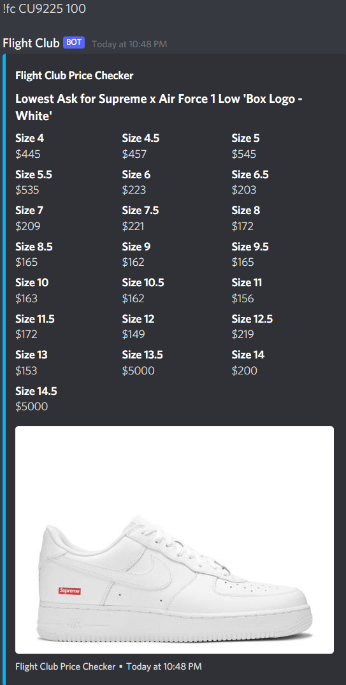

# flightclubstockchecker

Flight Club Stock Checker checks the current price for non-consigned shoes between Flight Club and Alias.
Currently it is only able to parse men's shoes and if you are looking to check consigned shoes replace 'marketPriceCents' with 'lowestConsignedPriceCents'

Steps to run:

Step 1) Input a discord bot's token and a webhook into settings.py

Step 2) Run the program and use the command !fc (shoe SKU/name)

Step 3) It will spit out the lowest ask and image for the sneaker.

Here's a example of the finished product

